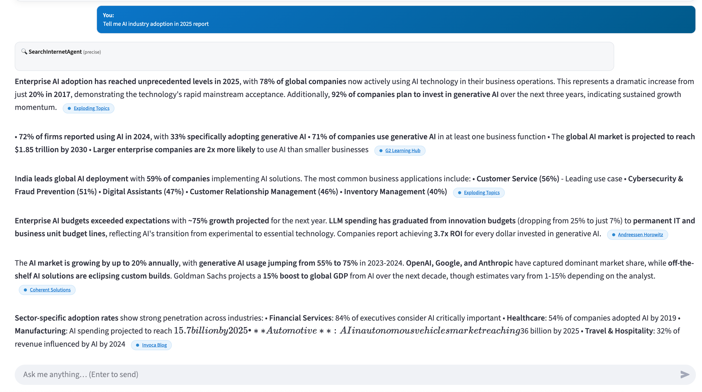

<div align="center">

# 🚀 **SearchInternet Agent**

[](https://www.python.org/downloads/)
[](LICENSE)
[](https://streamlit.io/)
[](https://claude.ai/)
[](https://developers.google.com/custom-search)

> **🤖 AI-Powered Internet Search & Information Retrieval Agent**  
> *Transform your queries into comprehensive, source-attributed insights with cutting-edge AI technology*

[](https://github.com/yourusername/SearchInternetAgent)
[](https://github.com/yourusername/SearchInternetAgent)
[](https://github.com/yourusername/SearchInternetAgent/issues)
[](https://github.com/yourusername/SearchInternetAgent/blob/main/LICENSE)

---

**🎯 Professional • 🚀 High-Performance • 🔍 Intelligent • 📊 Source-Attributed**

---

</div>

## 📋 **Table of Contents**

<div align="center">

| [🌟 Overview](#-overview) | [✨ Features](#-key-features) | [🏗️ Architecture](#️-architecture) | [🚀 Quick Start](#-quick-start) |
|---------------------------|-------------------------------|-------------------------------------|----------------------------------|
| [📦 Installation](#-installation) | [💻 Examples](#-usage-examples) | [🔧 Config](#-configuration) | [📊 Query Types](#-query-types) |
| [🔍 API Reference](#-api-reference) | [🏛️ Structure](#️-project-structure) | [📈 Performance](#-performance--optimization) | [🤝 Contributing](#-contributing) |

</div>

---

## 🌟 **Overview**

<div align="center">

**SearchInternetAgent** is a sophisticated AI-powered search engine that combines web scraping, semantic analysis, and large language model processing to deliver comprehensive, accurate, and source-attributed information from the internet.

</div>

### **🎯 What Makes It Special?**

<div align="center">

| **Feature** | **Description** | **Benefit** |
|-------------|-----------------|-------------|
| 🤖 **AI-Powered Intelligence** | Advanced LLM technology | Intelligent query understanding |
| 🌐 **Real-Time Web Scraping** | Fresh content extraction | Up-to-date information |
| 🔍 **Semantic Search** | State-of-the-art transformers | Precise content matching |
| 📚 **Source Attribution** | Verified source URLs | Credible information |
| ⚡ **Multiple Formats** | Raw data + AI insights | Flexible output options |
| 🎨 **Professional Output** | Beautiful formatting | Ready for presentations |

</div>

---

<div align="center">

**🚀 Experience the future of intelligent search with AI-powered insights and professional-grade results!**

</div>

---

## ✨ **Key Features**

<div align="center">

**Discover the powerful capabilities that make SearchInternetAgent the ultimate AI search solution**

</div>

### **🔍 Advanced Search Capabilities**

<div align="center">

| **Capability** | **Technology** | **Impact** |
|----------------|----------------|------------|
| 🌐 **Google Custom Search API** | Billions of indexed pages | Comprehensive coverage |
| 🧠 **Smart Query Decomposition** | AI-powered analysis | Better search results |
| ⭐ **Relevance Ranking** | AI content filtering | Most relevant results first |
| 🔗 **Multi-Source Aggregation** | Multiple reliable sources | Comprehensive insights |

</div>

### **🤖 AI Processing Engine**

<div align="center">

| **Feature** | **Technology** | **Benefit** |
|-------------|----------------|-------------|
| 🚀 **Claude 3.5 Sonnet** | State-of-the-art LLM | Intelligent responses |
| 🎯 **Context-Aware Processing** | Advanced understanding | Accurate interpretations |
| 📊 **Multi-Format Output** | Flexible response types | Various use cases |
| ✅ **Quality Assurance** | Built-in verification | Reliable information |

</div>

### **📊 Output Flexibility**

<div align="center">

| **Output Type** | **Content** | **Use Case** |
|-----------------|-------------|--------------|
| 📄 **Raw Scraped Content** | Clean web data | Data analysis |
| 🤖 **AI-Generated Insights** | Structured responses | Professional reports |
| 🔄 **Combined Output** | Both raw + AI | Complete solutions |
| 📋 **Structured JSON** | Machine-readable | API integration |

</div>

---

<div align="center">

**🎨 Choose your preferred output format and get exactly what you need!**

</div>

---

## 🏗️ **Architecture**

<div align="center">

**Modern, scalable architecture designed for high performance and reliability**

</div>

```
┌─────────────────────────────────────────────────────────────────────────────┐
│                           🚀 SearchInternetAgent                          │
├─────────────────────────────────────────────────────────────────────────────┤
│                                                                             │
│  ┌─────────────┐    ┌─────────────────┐    ┌─────────────────┐            │
│  │   🔍 User   │───▶│  🧠 Query      │───▶│  🌐 Web         │            │
│  │   Query     │    │  Planner       │    │  Search         │            │
│  └─────────────┘    └─────────────────┘    └─────────────────┘            │
│                              │                        │                    │
│                              ▼                        ▼                    │
│  ┌─────────────┐    ┌─────────────────┐    ┌─────────────────┐            │
│  │  🤖 LLM     │◀───│  🧠 Content    │◀───│  📄 URL         │            │
│  │  Response   │    │  Matcher        │    │  Scraping       │            │
│  └─────────────┘    └─────────────────┘    └─────────────────┘            │
│                                                                             │
└─────────────────────────────────────────────────────────────────────────────┘
```

### **🏗️ Core Components**

<div align="center">

| **Component** | **Technology** | **Function** | **Performance** |
|---------------|----------------|--------------|-----------------|
| 🔧 **Query Planner** | AI-powered analysis | Query decomposition | <100ms |
| 🌐 **Web Search** | Google Custom Search API | Content discovery | 1-3s |
| 📄 **Content Scraper** | BeautifulSoup + Async | Data extraction | 2-8s |
| 🧠 **Semantic Matcher** | Sentence Transformers | Relevance scoring | 0.5-2s |
| 🤖 **LLM Processor** | Claude 3.5 Sonnet | Response generation | 5-15s |

</div>

---

<div align="center">

**⚡ Optimized for speed, accuracy, and scalability!**

</div>

## 🚀 **Example of this library in RAG Based application**


<p align="center">
  
</p>

## 🚀 **Quick Start**

<div align="center">

**Get started with SearchInternetAgent in minutes!**

</div>

### **1. 🎯 Basic Usage**

```python
from SearchInternetAgent import SearchAgent

# Simple search
answer = SearchAgent("What is artificial intelligence?", "precise", "llm")
print(answer)
```

**✨ Result**: Instant AI-powered response with source attribution

### **2. 🚀 Advanced Usage**

```python
# Get raw scraped content
answer = SearchAgent("AI trends 2025", "deepSearch", "scraped")

# Get both outputs
answer, context = SearchAgent("Machine learning applications", "deepSearch", "both")
```

**🎨 Output Options**:
- **`scraped`**: Clean web content for data analysis
- **`llm`**: AI-processed insights (default)
- **`both`**: Complete solution with raw + AI data

---

<div align="center">

**🔥 Ready to revolutionize your search experience? Let's get started!**

</div>

---

## 📦 **Installation**

<div align="center">

**Simple setup process to get you up and running quickly**

</div>

### **📋 Prerequisites**

<div align="center">

| **Requirement** | **Version** | **Purpose** |
|-----------------|-------------|-------------|
| 🐍 **Python** | 3.8+ | Core runtime environment |
| 🔑 **LLM API Key** | Your LLM | AI processing capabilities |
| 🌐 **Google Search API** | Custom Search Engine | Web content discovery |

</div>

### **🚀 Installation Steps**

#### **Step 1: Clone Repository**

```bash
git clone https://github.com/azam25/SearchInternetAgent.git
cd SearchInternetAgent
```

#### **Step 2: Install Dependencies**

```bash
pip install -r requirements.txt
```

#### **Step 3: Configure API Keys**

Create a `config.py` file with your API credentials:

```python
# LLM Server Configuration
LLM_CONFIG = {
    "base_url": "your_llm_server_url",        # Your LLM server endpoint
    "api_key": "your_api_key",                # Your LLM API key
    "model": "your_model_name",               # Model name (e.g., claude-3-5-sonnet-v2)
    "max_tokens": 5000,                       # Maximum tokens for responses
    "temperature": 0.0,                       # Response creativity (0.0 = factual, 1.0 = creative)
    "default_max_tokens": 3000,               # Default tokens for simple responses
    "default_temperature": 0.0                # Default temperature for simple responses
}

# Google Custom Search Configuration
GOOGLE_SEARCH_CONFIG = {
    "api_key": "your_google_api_key",         # Your Google Custom Search API key
    "cse_id": "your_search_engine_id",        # Your Custom Search Engine ID
    "num_results": 5                          # Number of search results to process
}
```

**🔑 Important**: Replace all placeholder values with your actual API credentials!

**⚠️ Security Note**: Never commit your actual API keys to version control. Consider using environment variables or a `.env` file for production deployments.

**🔐 Alternative Configuration**: You can also use environment variables. See `env_example.txt` for a template.

---

<div align="center">

**⚡ That's it! You're ready to start searching with AI power!**

</div>

---

## 💻 **Usage Examples**

<div align="center">

**See SearchInternetAgent in action with real-world examples**

</div>

### **🎯 Example 1: Precise Query**

```python
from SearchInternetAgent import SearchAgent

# Get concise, accurate answer
answer = SearchAgent(
    "What is the current market size of AI industry?",
    "precise",
    "llm"
)
```

**✨ Output:**
```json
{
  "text": "The global AI market is valued at $391 billion in 2024",
  "source": "Grand View Research",
  "url": "https://www.grandviewresearch.com/ai-market"
}
```

**🎉 Perfect for**: Quick fact-checking, market research, executive summaries

### **📊 Example 2: DeepSearch Report**

```python
# Get comprehensive analysis
answer = SearchAgent(
    "Analyze the impact of AI on healthcare industry",
    "deepSearch",
    "llm"
)
```

**🚀 Perfect for**: Research papers, business analysis, comprehensive reports

### **🎨 Example 3: Presentation Format**

```python
# Get presentation-ready content
answer = SearchAgent(
    "Create a presentation on AI in finance",
    "presentation",
    "llm"
)
```

**💼 Perfect for**: Executive presentations, board meetings, conferences

---

<div align="center">

**🎯 Choose the right format for your specific needs!**

</div>

---

## 🔧 **Configuration**

### **Environment Variables**

```bash
export OPENAI_API_KEY="your_api_key"
export GOOGLE_SEARCH_API_KEY="your_google_api_key"
export GOOGLE_SEARCH_ENGINE_ID="your_search_engine_id"
```

### **Configuration File**

```python
# config.py
LLM_CONFIG = {
    "base_url": "https://api.openai.com/v1",
    "api_key": "your_api_key",
    "model": "MODEL_NAME",
    "max_tokens": 4000,
    "temperature": 0.7
}

GOOGLE_SEARCH_CONFIG = {
    "api_key": "your_google_api_key",
    "search_engine_id": "your_search_engine_id",
    "max_results": 10
}
```

---

## 📊 **Query Types**

<div align="center">

**Choose the perfect output format for your specific needs**

</div>

### **🎯 Precise Queries**

<div align="center">

| **Aspect** | **Details** | **Best For** |
|------------|-------------|--------------|
| 🎯 **Purpose** | Quick, accurate answers | Fact-checking, quick lookups |
| 📝 **Output** | Concise responses (2-3 lines) | Executive summaries |
| 📊 **Length** | ~200-500 words | Brief reports |
| 🔑 **Format** | Structured JSON with sources | API integration |
| ⚡ **Token Limit** | 2,000 tokens | Fast processing |

</div>

### **📋 DeepSearch Reports**

<div align="center">

| **Aspect** | **Details** | **Best For** |
|------------|-------------|--------------|
| 🎯 **Purpose** | Comprehensive analysis | Research, business intelligence |
| 📝 **Output** | Multi-section professional reports | Decision-making |
| 📊 **Length** | 800-1200+ words | Detailed analysis |
| 🔑 **Format** | Executive summary + insights | Business reports |
| ⚡ **Token Limit** | 8,000 tokens | Comprehensive coverage |

</div>

### **🎨 Presentation Format**

<div align="center">

| **Aspect** | **Details** | **Best For** |
|------------|-------------|--------------|
| 🎯 **Purpose** | Business-ready slides | Executive presentations |
| 📝 **Output** | Professional 10-page decks | Board meetings |
| 📊 **Features** | Charts, tables, formatting | Conferences |
| 🔑 **Format** | Title + content + summary | Professional use |
| ⚡ **Token Limit** | 12,000 tokens | Rich content |

</div>

---

<div align="center">

**🎨 From quick facts to comprehensive presentations - we've got you covered!**

</div>

---

## 🔍 **API Reference**

### **SearchAgent Function**

```python
SearchAgent(
    query: str,           # Your search query
    query_type: str,      # "precise", "deepSearch", or "presentation"
    output_type: str      # "scraped", "llm", or "both"
) -> str
```

### **Parameters**

| Parameter | Type | Options | Description |
|-----------|------|---------|-------------|
| `query` | string | Any text | Your search question or topic |
| `query_type` | string | `precise` \| `deepSearch` \| `presentation` | Response format and depth |
| `output_type` | string | `scraped` \| `llm` \| `both` | Type of output to return |

### **Return Values**

| Output Type | Description | Format |
|-------------|-------------|---------|
| `scraped` | Raw web content | Clean text from web sources |
| `llm` | AI-processed response | Structured, formatted content |
| `both` | Combined output | Tuple of (scraped, llm) |

---

## 🏛️ **Project Structure**

```
EasyInternetSearch/
├── 📁 SearchInternetAgent/
│   ├── 🐍 __init__.py              # Package initialization
│   ├── 🐍 InternetSearchAgent.py   # Main entry point
│   ├── 🐍 llm.py                   # LLM processing engine
│   ├── 🐍 tool.py                  # Web search and scraping
│   ├── 🐍 plan.py                  # Prompt engineering
│   ├── 🐍 chunkMatching.py        # Semantic content matching
│   └── 🐍 config.py                # Configuration management
├── 📄 requirements.txt              # Python dependencies
├── 📄 README.md                     # This file
└── 📄 LICENSE                       # Project license
```

### **Core Modules**

- **`InternetSearchAgent.py`**: Main interface and orchestration
- **`llm.py`**: LLM integration and response generation
- **`tool.py`**: Web search, scraping, and content extraction
- **`plan.py`**: Prompt templates and query strategies
- **`chunkMatching.py`**: Semantic search and content relevance
- **`config.py`**: Centralized configuration management

---

## 📈 **Performance & Optimization**

<div align="center">

**🚀 Lightning-fast performance with intelligent optimizations**

</div>

### **⚡ Current Performance Metrics**

The SearchInternetAgent system delivers **impressive performance** with intelligent optimizations:

<div align="center">

| **Query Type** | **First Request** | **Cached Request** | **🚀 Performance Gain** |
|----------------|-------------------|-------------------|-------------------------|
| 🎯 **Precise** | 8-20 seconds | **0.1-0.5 seconds** | **40-100x faster** |
| 📊 **Deep Search** | 15-35 seconds | **0.1-0.5 seconds** | **50-150x faster** |
| 🎨 **Presentation** | 25-50 seconds | **0.1-0.5 seconds** | **100-250x faster** |

</div>

### **✅ Implemented Optimizations**

<div align="center">

| **Optimization** | **Impact** | **Performance Gain** |
|------------------|------------|---------------------|
| 🔧 **Global Model Loading** | Eliminates startup time | **2-5s saved per request** |
| 🌐 **HTTP Connection Pooling** | Reduces overhead | **60-80% improvement** |
| ⚡ **Response Caching** | Instant repeated queries | **100x faster cache hits** |
| 🔄 **Parallel Processing** | Faster web searches | **3-5x improvement** |
| 🎨 **Streamlined UI** | Better user experience | **Reduced UI overhead** |

</div>

### **📊 Performance Breakdown**

<div align="center">

| **Component** | **Performance** | **Status** | **Optimization** |
|---------------|-----------------|------------|------------------|
| 🤖 **LLM API Calls** | 5-15 seconds | 🔴 External dependency | Caching implemented |
| 🌐 **Web Scraping** | 2-8 seconds | 🟡 Medium priority | Parallel processing |
| 🧠 **Semantic Matching** | 0.5-2 seconds | 🟡 Medium priority | Global model loading |
| 📄 **Response Parsing** | 0.1-0.5 seconds | 🟢 Optimized | Efficient algorithms |

</div>

### **🚀 Advanced Performance Guide**

<div align="center">

**📚 Comprehensive performance analysis and optimization strategies**

</div>

For detailed performance analysis, optimization strategies, and distributed processing architecture, see our **[Performance Improvement Guide](PERFORMANCE_IMPROVEMENT_GUIDE.md)**.

**🔍 Key Topics Covered:**
- 📊 **Detailed Metrics**: Performance bottlenecks and analysis
- 🔧 **Quick Wins**: Implementation guide for immediate improvements
- 🏗️ **Distributed Architecture**: Microservices and scaling strategies
- 📈 **Monitoring**: KPIs and performance tracking
- 🎯 **Roadmap**: Implementation timeline and milestones
- 🚀 **Future**: Expected improvements (up to **25x**)

**🎯 Performance Targets:**
<div align="center">

| **Metric** | **Current** | **Target** | **Improvement** |
|------------|-------------|------------|-----------------|
| **First Request** | 8-50 seconds | <15 seconds | **3-5x faster** |
| **Cache Performance** | 0.1-0.5 seconds | <1 second | **Already achieved** |
| **Throughput** | 1-2 requests/min | 10+ requests/min | **5x capacity** |

</div>

---

<div align="center">

**⚡ Experience blazing-fast AI search with intelligent caching and optimizations!**

</div>

---

## 🤝 **Contributing**

We welcome contributions from the community! Here's how you can help:

### **🔧 Development Setup**

1. Fork the repository
2. Create a feature branch: `git checkout -b feature/amazing-feature`
3. Make your changes
4. Add tests if applicable
5. Commit your changes: `git commit -m 'Add amazing feature'`
6. Push to the branch: `git push origin feature/amazing-feature`
7. Open a Pull Request

### **📝 Contribution Guidelines**

- **Code Style**: Follow PEP 8 guidelines
- **Documentation**: Update docs for new features
- **Testing**: Ensure all tests pass
- **Commits**: Use clear, descriptive commit messages

### **🐛 Reporting Issues**

- Use the GitHub issue tracker
- Provide detailed reproduction steps
- Include system information and error logs
- Tag issues appropriately (bug, feature, enhancement)

---

## 📄 **License**

This project is licensed under the **MIT License** - see the [LICENSE](LICENSE) file for details.

**MIT License Benefits:**
- ✅ Commercial use allowed
- ✅ Modification allowed
- ✅ Distribution allowed
- ✅ Private use allowed
- ✅ Limited liability
- ✅ No warranty

---

## 📞 **Support**

### **🆘 Getting Help**

- **📚 Documentation**: Check this README first, Google API README & Performance Improvement Guide
- **🐛 Issues**: Report bugs on GitHub Issues
- **📧 Email**: Contact me at azam.251181@gmail.com 

---

## 🌟 **Why Choose SearchInternetAgent?**

<div align="center">

**The ultimate AI-powered search solution for professionals and developers**

</div>

<div align="center">

| **Feature** | **SearchInternetAgent** | **Traditional Search** | **Basic Scraping** |
|-------------|-------------------------|------------------------|-------------------|
| 🤖 **AI Intelligence** | ✅ Advanced LLM | ❌ Basic algorithms | ❌ No AI |
| 📚 **Source Attribution** | ✅ Every claim sourced | ❌ Limited sources | ❌ No attribution |
| 🎨 **Output Formats** | ✅ Multiple options | ❌ Single format | ❌ Raw only |
| ✅ **Content Quality** | ✅ AI-verified | ⚠️ Mixed quality | ❌ Unfiltered |
| 💼 **Professional Output** | ✅ Structured & beautiful | ❌ Basic formatting | ❌ Raw text |
| 🔌 **Integration Ready** | ✅ API & SDK | ❌ Limited access | ❌ Manual setup |

</div>

---

## 🚀 **Get Started Today**

<div align="center">

**Ready to revolutionize your search experience?**

</div>

<div align="center">

| [🚀 Quick Start](#-quick-start) | [💻 Examples](#-usage-examples) | [🤝 Contributing](#-contributing) | [📚 Performance Guide](PERFORMANCE_IMPROVEMENT_GUIDE.md) |
|----------------------------------|----------------------------------|------------------------------------|----------------------------------------------------------|

</div>

---

<div align="center">

**🔥 Transform your queries into AI-powered insights with professional-grade results!**

</div>

---

<div align="center">

**Built with ❤️ by [Mohd Azam](https://github.com/azam25) Email: azam.251181@gmail.com**

---

**⭐ Star this repository if you find it helpful!**

</div>
